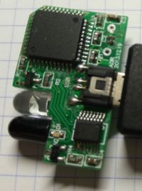

# IRBlaster test app

With this Java tool can record and send IR commands using a special device.

This is the same device used on [irmoduleyofeng](https://github.com/aaronps/irmoduleyofeng) and its [demo](https://github.com/aaronps/irmoduleyofeng-demo) for Android.

